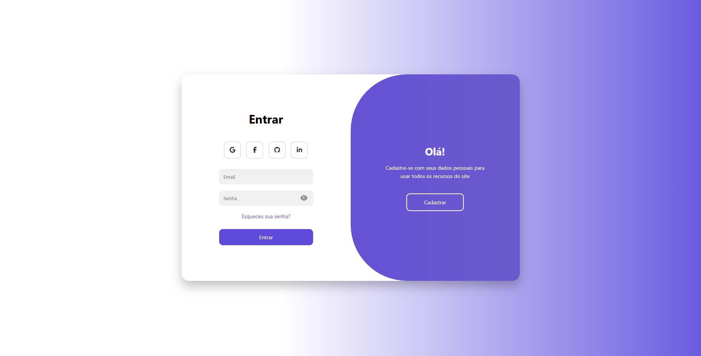
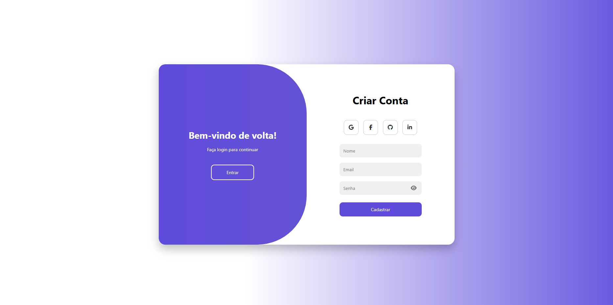
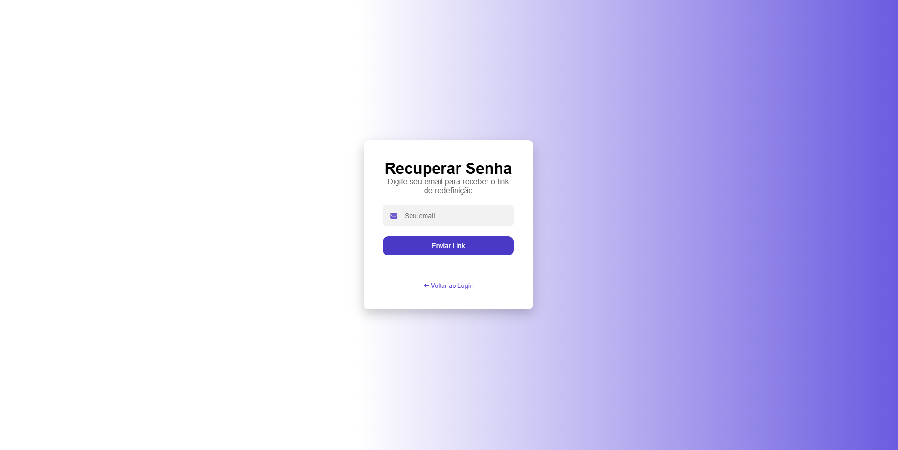

# 🔐 Sistema de Login e Recuperação de Senha

Projeto de interface moderna de autenticação desenvolvido com HTML, CSS e JavaScript.

## 📸 Preview do Projeto

### 🔐 Login

### 📝 Cadastro

### 🔑 Recuperação de Senhas

## 📖 Sobre o Projeto
Este projeto foi desenvolvido com o objetivo de praticar criação de interfaces modernas de login, cadastro e recuperação de senha com animações suaves e design responsivo.

A interface foi inspirada em um modelo em inglês e totalmente adaptada para português, com melhorias visuais e ajustes próprios.

## 🧠 Planejamento e Ideia
- Estudo de layouts modernos de autenticação
- Adaptação de design internacional
- Criação de animações suaves de entrada
- Implementação de overlay animado
- Organização do CSS em seções

## 🚀 Tecnologias Utilizadas
- HTML5
- CSS3
- JavaScript
- Flexbox
- CSS Animations
- Linear Gradient

## ✨ Funcionalidades
- Tela de Login
- Tela de Cadastro
- Recuperação de Senha
- Animações suaves
- Layout responsivo
- Design moderno

## 📚 Aprendizados

Durante o desenvolvimento foram praticados:

Estruturação de layouts modernos

Animações CSS

Organização de código

Design de interface

Responsividade

## 👨‍💻 Autor

Desenvolvido por [Dzk]
https://Dzk01.github.io/index.html
